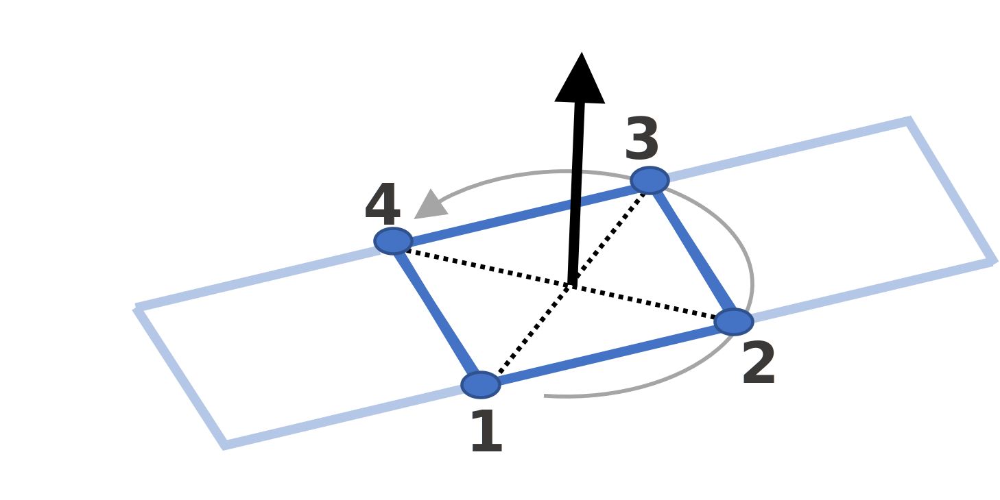

======
Meshes
======

.. note::
   A mesh in Capytaine is merely a set of independent faces (triangles or quadrangles).
   Connectivities are not required for the resolution.
   Having a mesh that is not watertight, with small gaps between the faces or a
   few missing faces, does not lead to qualitatively different results.

.. note::
   Besides loading existing mesh files, Capytaine includes some features to generate meshes for simple geometrical shapes, to clip a mesh at the free surface and generate a lid.
   The implementation of these features is only the minimum necessary to test the code and run simple cases.
   You might get slightly better results by using a more advanced meshing software to fine-tune the mesh, for instance by using cosine spacing near the edges or near the free surface, or by generating a full lid of the waterplane.

Naming
------

Meshes in Capytaine have a ``name`` attribute.
It is optional and is mostly used for clearer logging and outputs.
A ``name`` optional argument can be provided to all methods below to initialize
a mesh or transform a mesh to set the name of the new mesh.

.. _loading-a-mesh:

Mesh initialization
-------------------

Importing from file
~~~~~~~~~~~~~~~~~~~

To load an existing mesh file, use the following syntax::

    mesh = cpt.load_mesh('path/to/mesh.dat', file_format='nemoh')

The above example uses Nemoh's mesh format, which is one of the built-in hydrodynamic file formats that can be read by Capytaine.

+------------------+------------------------------+-------------------------------------------+
| Mesh file format | Keywords for ``file_format`` | Reference                                 |
+==================+==============================+===========================================+
| Nemoh            | ``'nemoh'``, ``'mar'``       | `Page 19 of Nemoh 3 manual <nemoh_ref>`_  |
+------------------+------------------------------+-------------------------------------------+
| WAMIT            | ``'wamit'``, ``'gdf'``       | `Chapter 6 of WAMIT manual <wamit_ref>`_  |
+------------------+------------------------------+-------------------------------------------+
| HAMS             | ``'hams'``, ``'pnl'``        | `Examples in HAMS repository <hams_ref>`_ |
+------------------+------------------------------+-------------------------------------------+
| Hydrostar        | ``'hydrostar'``, ``'hst'``   | Hydrostar manual                          |
+------------------+------------------------------+-------------------------------------------+

.. _`nemoh_ref`: https://gitlab.com/api/v4/projects/41313230/packages/generic/nemoh/v3.0.1/Nemoh_Manual_v3.0.1.pdf
.. _`wamit_ref`: https://www.wamit.com/manual7.x/html/wamit_v75manualch6.html
.. _`hams_ref`: https://github.com/YingyiLiu/HAMS

For the four file format above, the reflection symmetries (see :doc:`symmetries`) are recognized and a symmetric mesh will automatically be generated by ``load_mesh``.
Except for symmetries, all other metadata are ignored (such as the gravity acceleration value that can be set in ``gdf`` files).

If no ``file_format`` is given, the code will try to infer it from the file extension::

    mesh = cpt.load_mesh('path/to/mesh.gdf')

Besides accepting a path to a file, the function ``load_mesh`` accepts an opened file, as in the following example::

    with open('path/to/mesh.pnl', 'r') as f:
        mesh = cpt.load_mesh(f, file_format='hams')

In this case, the ``file_format`` must be explicitly provided.

This is especially useful when combined with Python built-in loaders for
compressed files formats such as `gz
<https://docs.python.org/3/library/gzip.html>`_, `xz
<https://docs.python.org/3/library/lzma.html>`_ or `zstd
<https://docs.python.org/3/library/compression.zstd.html>` files::

    import gzip
    with gzip.open('path/to/mesh.dat.gz', 'rt') as f:
        mesh = cpt.load_mesh(f, file_format='nemoh')

Importing through external library
~~~~~~~~~~~~~~~~~~~~~~~~~~~~~~~~~~

Capytaine relies on external libraries to load meshes for a lot more general purpose file formats.
For instance, assuming the Python library meshio_ has been installed, the following command will transparently open a GMSH file::

    mesh = cpt.load_mesh('path/to/mesh.msh', file_format='gmsh')
    # No need to explicitly import meshio, as long as it has been installed.

The table below list a few selected file formats supported through external libraries.

+------------------+------------------------------+---------------------------------------+
| Mesh file format | Keywords for ``file_format`` | Install one of these Python libraries |
+==================+==============================+=======================================+
| GMSH (v2 and v4) | ``"gmsh"``                   | meshio_                               |
+------------------+------------------------------+---------------------------------------+
| STL              | ``"stl"``                    | meshio_, trimesh_                     |
+------------------+------------------------------+---------------------------------------+
| VTK              | ``"vtk"``                    | meshio_                               |
+------------------+------------------------------+---------------------------------------+

.. _meshio: https://github.com/nschloe/meshio
.. _trimesh: https://trimesh.org/

This works with opened file handles, including compressed files, as in the previous section::

    import gzip
    with gzip.open('path/to/mesh.stl.gz', 'rb') as f:
        mesh = cpt.load_mesh(f, file_format='stl')

You might need to be careful whether the file format is binary (use ``'rb'``
option to open) or textual (use ``'rt'`` option to open).

Alternatively, ``load_mesh`` also accepts a Python object from these external
libraries::

    import meshio
    meshio_mesh = meshio.read('path/to/file.stl', file_format='stl')
    mesh = cpt.load_mesh(meshio_mesh)  # Converts meshio mesh object to Capytaine mesh object

This feature allows to use `pygmsh <https://pypi.org/project/pygmsh/>`_ to
generate the mesh, since this library returns mesh in the same format as meshio.
Below is an example of a mesh generation with `pygmsh` (which also needs to be
installed independently)::

    import pygmsh
    offset = 1e-2
    T1 = 0.16
    T2 = 0.37
    r1 = 0.88
    r2 = 0.35
    with pygmsh.occ.Geometry() as geom:
        cyl = geom.add_cylinder([0, 0, 0], [0, 0, -T1],  r1)
        cone = geom.add_cone([0, 0, -T1], [0, 0, -T2], r1, r2)
        geom.translate(cyl, [0, 0, offset])
        geom.translate(cone, [0, 0, offset])
        geom.boolean_union([cyl, cone])
        gmsh_mesh = geom.generate_mesh(dim=2)
    mesh = cpt.load_mesh(gmsh_mesh)

Predefined simple shapes
~~~~~~~~~~~~~~~~~~~~~~~~

Capytaine include mesh generators for a few simple shapes. They are mostly
meant for teaching (they are extensively used in the examples of this
documentation) as well as for testing.
The most useful ones are
:func:`~capytaine.meshes.predefined.spheres.mesh_sphere`,
:func:`~capytaine.meshes.predefined.cylinders.mesh_vertical_cylinder`,
:func:`~capytaine.meshes.predefined.cylinders.mesh_horizontal_cylinder`,
:func:`~capytaine.meshes.predefined.rectangles.mesh_parallelepiped`.
Some applications may also make use of flat shapes
:func:`~capytaine.meshes.predefined.cylinders.mesh_disk` and
:func:`~capytaine.meshes.predefined.rectangles.mesh_rectangle`.
Refer to their documentation for details about the parameters they accepts.

Since version 2.1, their resolution can be set by the ``faces_max_radius``
parameter which specifies the maximal size of a face in the mesh.

.. note::
    There are several ways to measure the size of a face and the resolution of a mesh.
    In Capytaine, the size of faces is usually quantified with the *radius* of the face, that is the maximal distance between the center of the face and its vertices.
    The resolution of a mesh is estimated as the maximal radius among all the faces in the mesh, that is the radius of the biggest face.

Creating from scratch
~~~~~~~~~~~~~~~~~~~~~

Alternatively, a mesh can be defined by giving a list of vertices and faces::

    mesh = cpt.Mesh(vertices=..., faces=..., name="my_mesh")

The vertices are expected to be provided as a Numpy array of floats with shape ``(nb_vertices, 3)``.
The faces are provided as a Numpy array of ints with shape ``(nb_faces, 4)``, such that the four integers on a line are the indices of the vertices composing that face::

    v = np.array([[0.0, 0.0, -1.0],
                  [1.0, 0.0, -1.0],
                  [1.0, 1.0, -1.0],
                  [0.0, 1.0, -1.0]])
    f = np.array([[0, 1, 2, 3]])
    single_face_mesh = cpt.Mesh(vertices=v, faces=f)

The ordering of the vertices define the direction of the normal vector, using
normal right rotation. In other words, the normal vector is towards you if you
see the vertices as being in counterclockwise order. In the above code sample,
the normal vector is going up.

   The ordering of the vertices in a panel defines the direction of the normal
   vector.

Triangular faces are supported as quadrilateral faces with the same vertex
repeated twice::

    single_triangle_mesh = cpt.Mesh(vertices=v, faces=np.array([[0, 1, 2, 2]]))

Display
-------

Use the :code:`show` method to display the mesh in 3D using VTK (if installed)
with the :meth:`~capytaine.meshes.meshes.Mesh.show`::

    mesh.show()

or with Matplotlib (if installed) with
:meth:`~capytaine.meshes.meshes.Mesh.show_matplotlib`::

    mesh.show_matplotlib()

Geometric transformations
-------------------------
Several functions are available to transform existing meshes.

Below is a list of most of the available methods.
All of them can be applied to both meshes or to floating bodies, in which case
the degrees of freedom will also be transformed::

    # TRANSLATIONS
    mesh.translated_x(10.0)
    mesh.translated_y(10.0)
    mesh.translated_z(10.0)
    mesh.translated([10.0, 5.0, 2.0])

    # Translation such that point_a would become equal to point_b
    mesh.translated_point_to_point(point_a=[5, 6, 7], point_b=[4, 3, 2])

    # ROTATIONS
    mesh.rotated_x(3.14/5)  # Rotation of pi/5 around the Ox axis
    mesh.rotated_y(3.14/5)  # Rotation of pi/5 around the Oy axis
    mesh.rotated_z(3.14/5)  # Rotation of pi/5 around the Oz axis

    # Rotation of pi/5 around an arbitrary axis.
    from capytaine import Axis
    my_axis = Axis(vector=[1, 1, 1], point=[3, 4, 5])
    mesh.rotated(axis=my_axis, angle=3.14/5)

    # Rotation around a point such that vec1 becomes aligned with vec2
    mesh.rotated_around_center_to_align_vector(
        center=(0, 0, 0),
        vec1=(1, 4, 7),
        vec2=(9, 2, 1)
    )

    # REFLECTIONS
    from capytaine import Plane
    mesh.mirrored(Plane(normal=[1, 2, 1], point=[0, 4, 5]))

All the above methods can also be applied to :class:`~capytaine.meshes.geometry.Plane`
and :class:`~capytaine.meshes.geometry.Axis` objects.

Meshes can also be merged together with the :code:`+` operator::

    larger_mesh = mesh_1 + mesh_2

Finally, meshes can be clipped with a :class:`~capytaine.meshes.geometry.Plane`.
The plane is defined by a point belonging to it and a normal vector::

    xOy_Plane = Plane(point=(0, 0, 0), normal=(0, 0, 1))
    clipped_mesh = mesh.clipped(xOy_Plane)

Beware that the orientation of the normal vector of the :code:`Plane` will
determine which part of the mesh will be returned::

    higher_part = mesh.clipped(Plane(point=(0, 0, 0), normal=(0, 0, -1)))
    lower_part = mesh.clipped(Plane(point=(0, 0, 0), normal=(0, 0, 1)))
    # mesh = lower_part + higher_part

The method :meth:`immersed_part` will clip the body with respect to two
horizontal planes at :math:`z=0` and :math:`z=-h`::

    clipped_body = mesh.immersed_part(water_depth=10)

.. note::
    Most transformation methods exist in two versions:

    * one, named as a infinitive verb (`translate`, `rotate`, `clip`,
      `keep_immersed_part`, ...), is an in-place transformation;
    * the other, named as a past participle (`translated`, `rotated`,
      `clipped`, `immersed_part`, ...), is the same transformation but
      returning a new object.

    In most cases, performance is not significant and the method returning a
    new object should be preferred. In-place transformation are currently kept
    for backward compatibility, but they make the code significantly more
    complicated and their removal might be considered in the future.

.. _lid-generation:

Extracting or generating a lid
------------------------------

If you loaded a mesh file already containing a lid on the :math:`z=0` plane,
the hull and the lid can be split with the
:meth:`~capytaine.meshes.meshes.Mesh.extract_lid` method::

    full_mesh = cpt.load_mesh(...)
    hull_mesh, lid_mesh = full_mesh.extract_lid()

If your mesh does not have a lid, you can generate a lid using
:meth:`~capytaine.meshes.meshes.Mesh.generate_lid` as follows::

    lid_mesh = hull_mesh.generate_lid()

The mesh is generated on the free surface by default, unless the ``z`` optional argument is passed to :meth:`~capytaine.meshes.meshes.Mesh.generate_lid`.
The method :meth:`~capytaine.meshes.meshes.Mesh.generate_lid` also accepts
an optional argument ``faces_max_radius`` to set the resolution of the lid.
By default, the mean resolution of the hull mesh is used.

See :ref:`set-lid-mesh-in-body` for details on how to assign a lid mesh when
defining a floating body.

Defining an integration quadrature
----------------------------------

.. note::
   Quadratures are an advanced feature meant to experiment with numerical schemes.
   The best compromise between precision and performance is often not to bother
   with it and keep the default integration scheme.

During the resolution of the BEM problem, the Green function has to be
integrated on each panel of the mesh. Parts of the Green function (such as the
:math:`1/r` Rankine terms) are integrated using an exact analytical expression
for the integral. Other parts of the Green function rely on numerical
integration. By default, this numerical integration is done by taking the value
at the center of the panel and multiplying by its area. For a more accurate
intagration, an higher order quadrature can be defined.

To define a quadrature scheme for a mesh, run the following command::

    mesh.compute_quadrature(method="Gauss-Legendre 2")

The quadrature data can then be accessed at::

    mesh.quadrature_points

and will be used automatically when needed.

.. warning:: Transformations of the mesh (merging, clipping, ...) may reset the quadrature.
             Compute it only on your final mesh.

.. warning:: Quadratures schemes have been designed with quadrilateral panels.
             They work on triangular panels, but might not be as optimal then.

Alternatively, the :func:`~capytaine.meshes.meshes.Mesh.compute_quadrature`
also accepts methods from the `Quadpy` package::

    import quadpy
    mesh.compute_quadrature(method=quadpy.c2.get_good_scheme(8))
